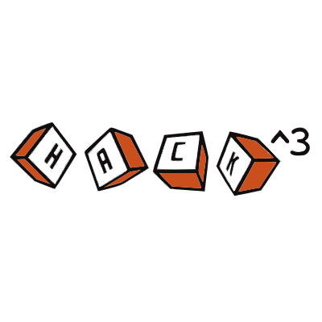

    	
<div align=left>
                  
# PHP Master

​DD<sup>th</sup> Month YYYY

​Challenge Author(s): 

### Description:

This challenge...

### Objective

Find a logic bug through source code auditing.

### Difficulty: 
`easy`

### Flag:
`HTB{s0me_fl4g_her3}`
</div>

​		


# Challenge


# Solver

```python

```
