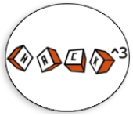

    	
<div align=right>
                  
# PHP Master

​	DD<sup>th</sup> Month YYYY

​	Challenge Author(s): 
</div>

​		

 


### Description:

This challenge...

### Objective

Find a logic bug through source code auditing.

### Difficulty:

`easy`

### Flag:

`HTB{s0me_fl4g_her3}`


# Challenge


# Solver

```python

```
